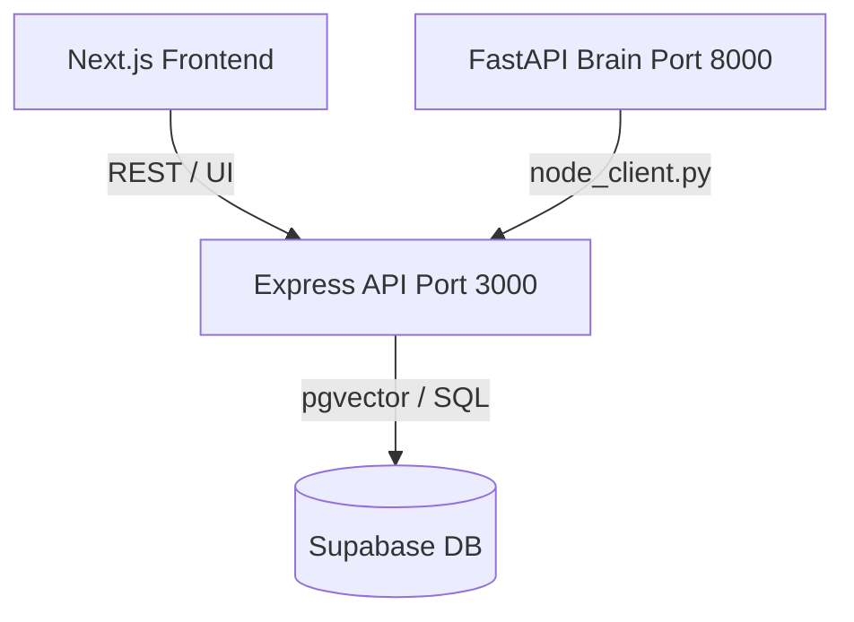

# DreamTalk Brain & DB Integration Guide

This guide details the integration architecture, initial setup steps, and the complete REST API reference for the DreamTalk Brain-Database bridge.

---

## 🏗️ Architecture Overview

The system operates as a 3-tier architecture:
1. **Frontend (Next.js)**: Standard UI on Port `10000`.
2. **Node.js Express Backend**: The DB driver on Port `3000` that handles authenticated writes to Supabase.
3. **Python FastAPI Brain**: The cognitive simulator on Port `8000`. The Python code makes REST requests to the Node.js Express Backend via a clean HTTP client (`node_client.py`).



---

## 🚀 Initial Setup

### 1. Database Schema
Before running the services, apply the SQL schema to Supabase:
1. Go to your **Supabase Dashboard** ➔ **SQL Editor**.
2. Run `CREATE EXTENSION IF NOT EXISTS vector;` if not already enabled.
3. Copy the entire contents of [schema.sql](file:///c:/Users/atulk/OneDrive/Desktop/Dreamtalk/Dreamtalk_Emotion_Engine_v.1.0.0/schema.sql) and execute it. This creates the 7 required tables:
   - `users`, `chat_sessions`, `chat_messages`, `emotion_logs`, `relationship_scores`, `memory_entries`, `pad_state_snapshots`.

### 2. Node.js Backend Setup
1. Open a terminal and navigate to `node_backend/`.
2. Install dependencies:
   ```bash
   cd node_backend
   npm install
   ```
3. Setup environment variables:
   - Copy `.env.example` to `.env`
   - Fill in your `SUPABASE_URL` and `SUPABASE_SECRET_KEY` (use the `service_role` key as this backend bypasses RLS policies to write records).
   - Define a strong `BRAIN_API_KEY` (e.g. run `openssl rand -hex 32` to generate one).
4. Run the backend:
   ```bash
   # Development / Production
   npm start
   ```

### 3. Python Backend Setup
The Python client needs the `requests` library to communicate:
1. Make sure you are in the python environment and run:
   ```bash
   pip install -r requirements.txt
   ```
2. Add environment variables to your Python environment / `.env`:
   - `NODE_BACKEND_URL=http://localhost:3000`
   - `BRAIN_API_KEY=your_generated_brain_api_key_matching_node_backend`
3. Use the client in your code:
   ```python
   from backend.node_client import node_client
   
   # Example: Start session on reset
   session = node_client.start_session(user_id="user-uuid-here", scenario_name="grief_support")
   session_id = session["id"]
   ```

---

## 🔑 Authentication
Every REST API request made to the Node.js backend must include the shared secret key in the request headers:
```http
X-Brain-Api-Key: <your_brain_api_key>
Content-Type: application/json
```

---

## 📡 REST API Reference

All routes are mounted at `/api/brain` and require the `X-Brain-Api-Key` header.

### ── 1. Sessions & Messages ──

#### `POST /sessions/start`
Creates a new chat session when the Python module resets.
* **Request Body**:
  ```json
  {
    "user_id": "UUID",
    "scenario_name": "string (optional)"
  }
  ```
* **Response**: `201 Created`
  ```json
  {
    "success": true,
    "session": { "id": "session-uuid", "status": "active", ... }
  }
  ```

#### `POST /sessions/close`
Closes a chat session and records final metrics.
* **Request Body**:
  ```json
  {
    "session_id": "UUID",
    "total_turns": 15,
    "final_relationship_score": 0.85,
    "cumulative_reward": 12.4
  }
  ```
* **Response**: `200 OK`

#### `POST /sessions/message`
Persists the turn-level user message and brain response preview.
* **Request Body**:
  ```json
  {
    "session_id": "UUID",
    "user_id": "UUID",
    "turn_index": 2,
    "user_content": "Hello",
    "assistant_content": "Hi there"
  }
  ```
* **Response**: `201 Created`

#### `GET /sessions/user/:user_id`
Retrieves chat sessions for a user, ordered descending by date.
* **Query Params**: `limit` (default: 20)
* **Response**: `200 OK`

#### `GET /sessions/:session_id`
Retrieves details of a single chat session.
* **Response**: `200 OK`

#### `GET /sessions/:session_id/messages`
Retrieves all messages for a session ordered by turn index.
* **Response**: `200 OK`

---

### ── 2. Emotion Logs ──

#### `POST /emotion/log`
Logs the brain's PAD decisions and rewards for analysis.
* **Request Body**:
  ```json
  {
    "session_id": "UUID",
    "user_id": "UUID",
    "turn_index": 3,
    "user_pleasure": 0.1,
    "user_arousal": 0.2,
    "pad_pleasure": 0.5,
    "pad_arousal": -0.2,
    "pad_dominance": 0.3,
    "emotion_label": "warm_curiosity",
    "memory_action": "RETRIEVE_LTM",
    "response_style": "empathetic",
    "inertia_strength": 0.75,
    "reward": 1.2,
    "verdict": "PERFECT_READ",
    "relationship_delta": 0.05
  }
  ```
* **Response**: `201 Created`

#### `GET /emotion/history/:user_id`
Retrieves logs for emotional analysis.
* **Query Params**: `limit` (default: 50)
* **Response**: `200 OK`

#### `GET /emotion/summary/:user_id`
Aggregates verdict counts and average rewards to track learning patterns.
* **Response**: `200 OK`
  ```json
  {
    "success": true,
    "summary": {
      "total_turns": 45,
      "avg_reward": 0.65,
      "verdict_counts": {
        "PERFECT_READ": 20,
        "CORRECT": 15,
        "EMOTIONAL_DEAF": 10
      }
    }
  }
  ```

---

### ── 3. Relationship Scores ──

#### `POST /emotion/relationship`
Upserts a user's running relationship score card.
* **Request Body**:
  ```json
  {
    "user_id": "UUID",
    "score": 0.72,
    "total_sessions": 5,
    "total_turns": 120,
    "miss_count": 4,
    "overreact_count": 2,
    "avg_reward": 0.8
  }
  ```
* **Response**: `200 OK`

#### `GET /emotion/relationship/:user_id`
Gets the current relationship profile. Returns default stats (`score = 0.5`) if not found.
* **Response**: `200 OK`

---

### ── 4. PAD State Snapshots (Arc Charting) ──

#### `POST /emotion/pad-snapshot`
Logs the active PAD values for plotting curves in dashboards.
* **Request Body**:
  ```json
  {
    "session_id": "UUID",
    "user_id": "UUID",
    "turn_index": 4,
    "pleasure": 0.6,
    "arousal": -0.3,
    "dominance": 0.4
  }
  ```
* **Response**: `201 Created`

#### `GET /emotion/pad-arc/:session_id`
Retrieves the sequential PAD trajectory of a session.
* **Response**: `200 OK`

---

### ── 5. Memory ──

#### `POST /memory`
Persists a long-term memory chunk.
* **Request Body**:
  ```json
  {
    "user_id": "UUID",
    "content": "User mentioned they own a golden retriever named Max.",
    "session_id": "UUID (optional)",
    "importance": 1.5,
    "embedding": [0.02, -0.05, ...]
  }
  ```
* **Response**: `201 Created`

#### `GET /memory/:user_id`
Retrieves memories, sorted by importance and creation date.
* **Query Params**: `limit` (default: 100)
* **Response**: `200 OK`

#### `PATCH /memory/:memory_id/touch`
Touches the memory to update `last_accessed` date, preventing it from decay.
* **Response**: `200 OK`

#### `DELETE /memory/:user_id/prune`
Keeps the user memory index size lean.
* **Query Params**: `keep` (number of memories to retain; default: 200)
* **Response**: `200 OK`
  ```json
  {
    "success": true,
    "pruned": 14
  }
  ```
